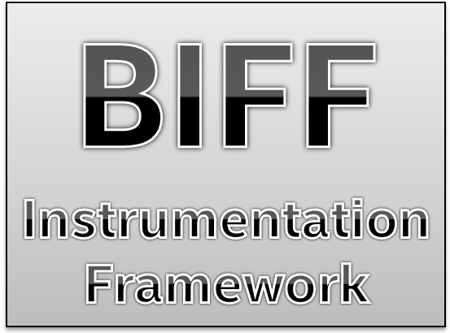
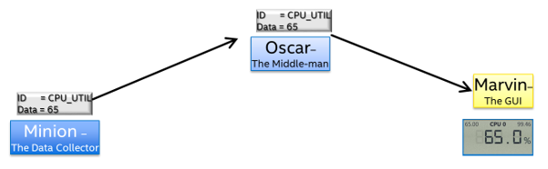
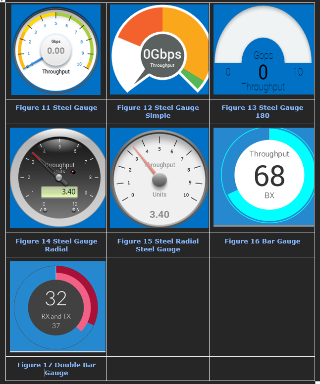
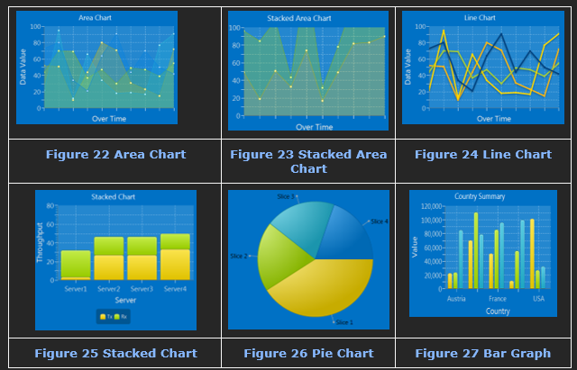
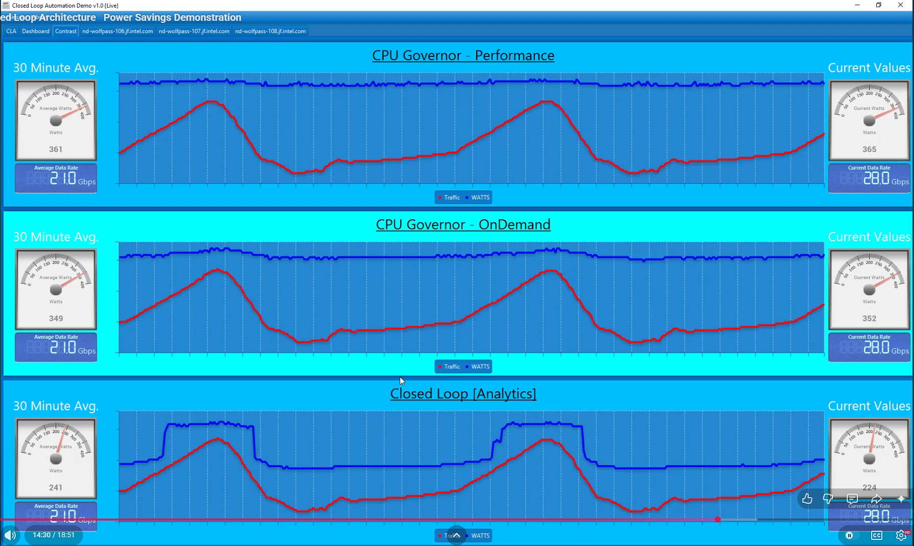
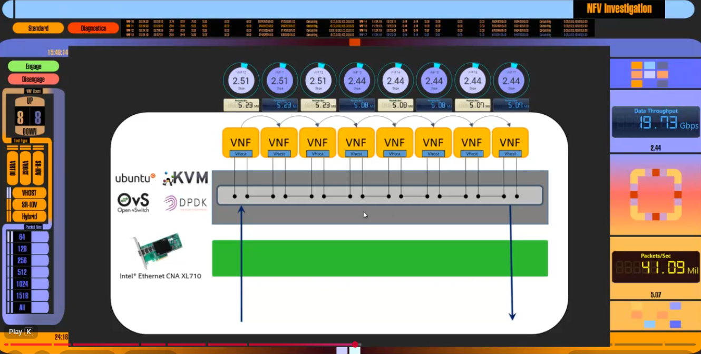

## THIS PROJECT IS A MAINTINED FORK

This repository is an independent fork of the original Intel project, created after separating from Intel, as Intel archived the original repository. It is maintained here for continued use, experimentation, and community-driven improvement.

# Board-Instrumentation-Framework
This project allows you to instrument and graphically display pretty much anything you want in a flexible way. 
It consists of 3 parts, the data collector (Minion) written in Python, which sends data over a UDP socket to the data broker and recorder called Oscar, also written in Python.  The last part is a Java FX application called Marvin, which receives data from Oscar and displays it via a library of highly configurable 'widgets'.

# Some Sample Widgets
## Dials

### Charts

# Examples
Here are a couple of my YouTube videos that make use of this framework:

Take a look at the 200+ page BIFF Instrumenation Framework User Guide.pdf file for details and build instructions: https://github.com/PatrickKutch/Board-Instrumentation-Framework/blob/main/BIFF%20Instrumentation%20Framework%20User%20Guide.pdf.
